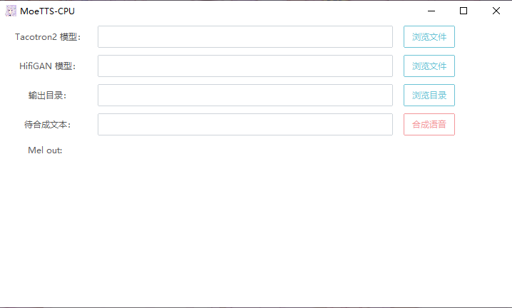
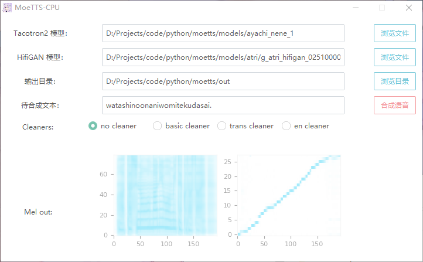

# MoeTTS
Speech synthesis model repo for galgame characters based on Tacotron2 and Hifigan

简体中文   English(Todo..)

## 关于

这个是一个用于存放基于Tacotron2与Hifigan的galgame角色语音合成模型库。另外也用于发行编译后的推理GUI。

hifi-gan: https://github.com/jik876/hifi-gan

Tacotron2: https://github.com/NVIDIA/tacotron2

## 使用方法

打开软件后，分别选择您的模型路径与输出目录，最后输入待合成文本，点击`合成语音`等待一会软件会将音频输出到`输出目录/outpus.wav`

注意事项：

 1. 首次合成需要加载模型，耗时较长，相同模型再次合成不会再次加载，直接合成。
 2. 如果切换模型，再次合成会重新加载。
 3. Hifigan的config.json需要放置在与模型同路径下。
 4. 软件为64位版本，不支持32位系统。

示例：

## 模型下载

提交格式参考：

x. 模型名

描述：角色xxx的模型

下载地址：

配套Hifigan模型下载：选填

详细信息：选填

1. ATRI

   描述：游戏 ATRI- My dear moments 的角色ATRI模型

   下载地址：链接：https://pan.baidu.com/s/1hJIbIX0r1UpI3UEtsp-6EA?pwd=jdi4 提取码：jdi4

   配套HifiGAN模型下载：链接：https://pan.baidu.com/s/1PGU8XEs5wy4ppJL6GjTgMQ?pwd=24g8 提取码：24g8

   详细信息：从游戏中选择1300条语音训练，训练约600 Epoch

   

## 分享模型&参与开发

欢迎分享你的预训练模型，由于模型较大，暂时不打算存放在GitHub，可以拉取该项目后将你的模型下载地址以及信息写在Readme的模型下载部分中。提交PR即可。

如果有任何优化建议或者BUG可以提issue。